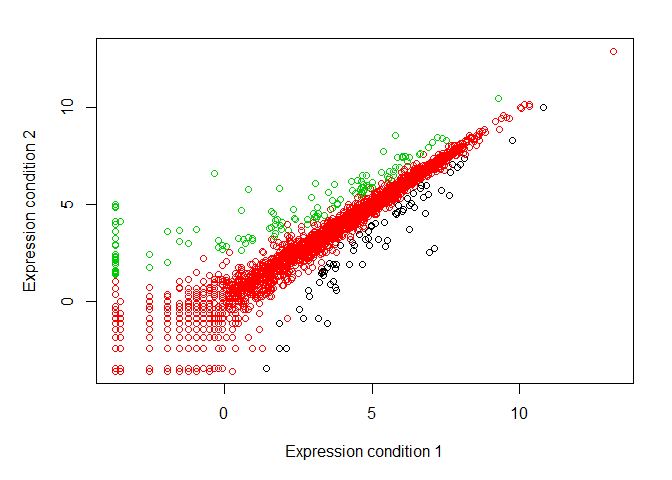
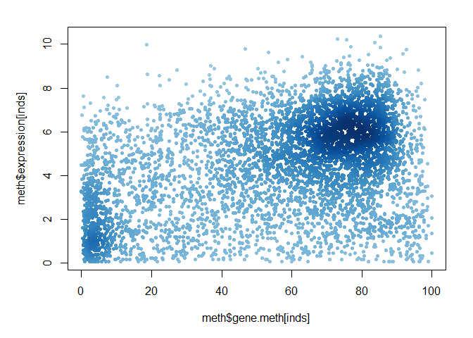

Class5 Data exploration and visualization in R
================
Xueyi Wan
2019-10-31

``` r
# Class5 Data visualization
x <- rnorm(1000)
# gives 1000 random normal distribution data points

# some summary stats
mean(x)
```

    ## [1] -0.02099081

``` r
sd(x)
```

    ## [1] 0.9645885

``` r
summary(x)
```

    ##     Min.  1st Qu.   Median     Mean  3rd Qu.     Max. 
    ## -3.13586 -0.68923 -0.01955 -0.02099  0.64290  3.76984

``` r
boxplot(x)
```

<!-- -->

``` r
hist(x)
rug(x)
```

<!-- -->

``` r
# read.table instructions
#   read.csv and read.csv2 are identical to read.table except for the 
# defaults. They are intended for reading ‘comma separated value’ 
# files (‘.csv’) or (read.csv2) the variant used in countries that 
# use a comma as decimal point and a semicolon as field separator. 
# Similarly, read.delim and read.delim2 are for reading delimited 
# files, defaulting to the TAB character for the delimiter. 

# Section 2 scatter plots
# lets read our input file

weight <- read.table("bimm143_05_rstats/weight_chart.txt", header = TRUE)
plot(weight$Age, weight$Weight, type = "o", pch = 15, cex = 1.5, lwd = 2, 
     ylim = c(2,10), xlab = "Age(months)", ylab = "Weight(kg)", 
     main = "Baby weight with age", col = "blue")
```

<!-- -->

``` r
plot(1:5, pch=1:5, cex=1:5)
```

<!-- -->

``` r
# Section 2 Barplot

mouse <- read.delim("bimm143_05_rstats/feature_counts.txt")
par(mar = c(3.1, 11.1, 4.1, 2))
barplot(mouse$Count, horiz = TRUE, names.arg = mouse$Feature, 
        main = "Number of features in the mouse GRCm38 genome", 
        las = 1, xlim = c(0,80000))
```

<!-- -->

``` r
# Section 2 Histograms

x <- c(rnorm(10000), rnorm(10000)+4)
hist(x, breaks = 80)
```

<!-- -->

``` r
# Section 3 Providing color vectors

people <- read.delim("bimm143_05_rstats/male_female_counts.txt", 
                     header = TRUE)
par(mar = c(5,5,2,2))
# make all bars different colors using the rainbow() function
# note the nrow() function
barplot(people$Count, names.arg = people$Sample, las = 2, 
        ylab = "Counts", cex.names = 0.7, 
        col = rainbow(nrow(people)))
```

<!-- -->

``` r
# alternate male & female samples
# pass a 2 color vector to eh col parameter
barplot(people$Count, names.arg = people$Sample, las = 2, 
        ylab = "Counts", cex.names = 0.7, 
        col = c("blue2", "red2"))
```

<!-- -->

``` r
# Section 3 coloring by value

genes <- read.delim("bimm143_05_rstats/up_down_expression.txt")
# How many genes are detailed in this file (how many rows)
nrow(genes)
```

    ## [1] 5196

``` r
# To determine how many genes are up, down and unchanging
table(genes$State)
```

    ## 
    ##       down unchanging         up 
    ##         72       4997        127

``` r
plot(genes$Condition1, genes$Condition2, col = genes$State, 
    xlab = "Expression condition 1", ylab = "Expression condition 2")
```

<!-- -->

``` r
# to know the order of states levels
levels(genes$State)
```

    ## [1] "down"       "unchanging" "up"

``` r
# using the correct colors in the correct order
palette(c("blue", "grey", "red"))

# Section 3 Dynamic use of color

meth <- read.delim("bimm143_05_rstats/expression_methylation.txt")
# How many genes are in this dataset
nrow(meth)
```

    ## [1] 9241

``` r
# use densCols() function to make a new color vector 
dcols <- densCols(meth$gene.meth, meth$expression)
# plot changing the plot character ('pch') to a solid circle
plot(meth$gene.meth, meth$expression, col = dcols, pch = 20)
```

<!-- -->

``` r
# retrict to the genes that have more than zero expression values
# Find the indices of genes with above 0 expression
inds <- meth$expression > 0
# Make a density color vector for these genes
dcols <- densCols(meth$gene.meth[inds], meth$expression[inds])
# plot just these genes
plot(meth$gene.meth[inds], meth$expression[inds], col = dcols, 
     pch = 20)
```

<!-- -->

``` r
# change the colramp used by the densCols() function to go between
# blue, green, red and yellow with the colorRampPalette() function
dcols.custom <- densCols(meth$gene.meth[inds],
                         meth$expression[inds], 
                         colramp = colorRampPalette(c("blue2", 
                                                    "green2", 
                                                    "red2", 
                                                    "yellow")))
plot(meth$gene.meth[inds], meth$expression[inds], 
     col = dcols.custom, pch = 20)
```

<!-- -->

``` r
# About this document
sessionInfo()
```

    ## R version 3.6.1 (2019-07-05)
    ## Platform: x86_64-w64-mingw32/x64 (64-bit)
    ## Running under: Windows 10 x64 (build 18362)
    ## 
    ## Matrix products: default
    ## 
    ## locale:
    ## [1] LC_COLLATE=Chinese (Simplified)_China.936 
    ## [2] LC_CTYPE=Chinese (Simplified)_China.936   
    ## [3] LC_MONETARY=Chinese (Simplified)_China.936
    ## [4] LC_NUMERIC=C                              
    ## [5] LC_TIME=Chinese (Simplified)_China.936    
    ## 
    ## attached base packages:
    ## [1] stats     graphics  grDevices utils     datasets  methods   base     
    ## 
    ## loaded via a namespace (and not attached):
    ##  [1] compiler_3.6.1     magrittr_1.5       tools_3.6.1       
    ##  [4] htmltools_0.4.0    yaml_2.2.0         Rcpp_1.0.2        
    ##  [7] KernSmooth_2.23-15 stringi_1.4.3      rmarkdown_1.16    
    ## [10] highr_0.8          knitr_1.25         stringr_1.4.0     
    ## [13] xfun_0.10          digest_0.6.21      rlang_0.4.0       
    ## [16] evaluate_0.14
