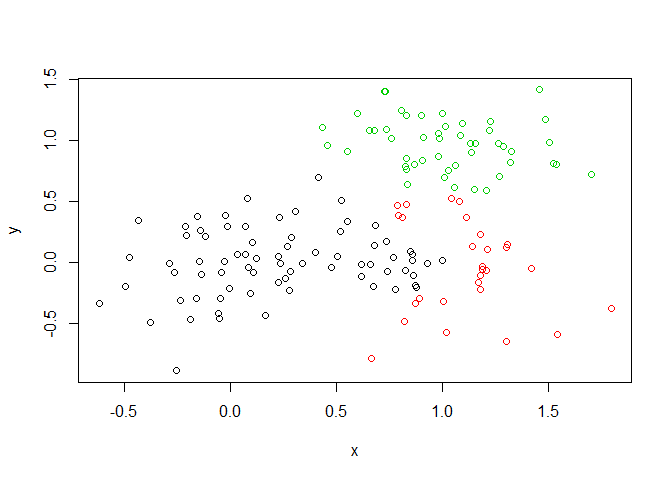
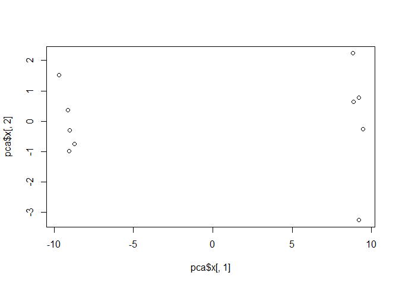

class08
================
Xueyi Wan
2019/10/24

## K-means clustering

``` r
# Generate some example data for clustering
temp <- c(rnorm(30, -3), rnorm(30, 3))
x <- cbind(x = temp, y = rev(temp))

plot(x)
```

<!-- -->

Use the **kmeans()** function setting k to 2 and nstart=20

``` r
k <- kmeans(x, centers = 2, nstart = 20)
```

Inspect/print the results

``` r
k
```

    ## K-means clustering with 2 clusters of sizes 30, 30
    ## 
    ## Cluster means:
    ##           x         y
    ## 1 -2.841615  3.031295
    ## 2  3.031295 -2.841615
    ## 
    ## Clustering vector:
    ##  [1] 1 1 1 1 1 1 1 1 1 1 1 1 1 1 1 1 1 1 1 1 1 1 1 1 1 1 1 1 1 1 2 2 2 2 2
    ## [36] 2 2 2 2 2 2 2 2 2 2 2 2 2 2 2 2 2 2 2 2 2 2 2 2 2
    ## 
    ## Within cluster sum of squares by cluster:
    ## [1] 71.77003 71.77003
    ##  (between_SS / total_SS =  87.8 %)
    ## 
    ## Available components:
    ## 
    ## [1] "cluster"      "centers"      "totss"        "withinss"    
    ## [5] "tot.withinss" "betweenss"    "size"         "iter"        
    ## [9] "ifault"

Q. How many points are in each cluster? Q. What ‘component’ of your
result object details - cluster size? - cluster assignment/membership? -
cluster center?

``` r
k$size
```

    ## [1] 30 30

``` r
k$cluster
```

    ##  [1] 1 1 1 1 1 1 1 1 1 1 1 1 1 1 1 1 1 1 1 1 1 1 1 1 1 1 1 1 1 1 2 2 2 2 2
    ## [36] 2 2 2 2 2 2 2 2 2 2 2 2 2 2 2 2 2 2 2 2 2 2 2 2 2

``` r
k$centers
```

    ##           x         y
    ## 1 -2.841615  3.031295
    ## 2  3.031295 -2.841615

Plot x colored by the kmeans cluster assignment and add cluster centers
as blue points

``` r
plot(x, col = k$cluster)
points(k$centers, col = "blue", pch = 15)
```

<!-- -->

## Hierarchical clustering in R

The ‘hclust()’ function requires a distance matrix as input. You can get
this from the ‘dist()’ function

``` r
# First we need to calculate point (dis)similarity
# as the Euclidean distance between observations
dist_matrix <- dist(x)

# The hclust() function returns a hierarchical
# clustering model
hc <- hclust(d = dist_matrix)

# the print method is not so useful here
hc
```

    ## 
    ## Call:
    ## hclust(d = dist_matrix)
    ## 
    ## Cluster method   : complete 
    ## Distance         : euclidean 
    ## Number of objects: 60

``` r
# Draws a dendrogram
plot(hc)
abline(h = 6, col = "red")
```

<!-- -->

``` r
cutree(hc, h = 6) # Cut by height h
```

    ##  [1] 1 1 1 1 1 1 1 1 1 1 1 1 1 1 1 1 1 1 1 1 1 1 1 1 1 1 1 1 1 1 2 2 2 2 2
    ## [36] 2 2 2 2 2 2 2 2 2 2 2 2 2 2 2 2 2 2 2 2 2 2 2 2 2

``` r
cutree(hc, k = 2) # Cut into k groups
```

    ##  [1] 1 1 1 1 1 1 1 1 1 1 1 1 1 1 1 1 1 1 1 1 1 1 1 1 1 1 1 1 1 1 2 2 2 2 2
    ## [36] 2 2 2 2 2 2 2 2 2 2 2 2 2 2 2 2 2 2 2 2 2 2 2 2 2

``` r
# Step 1. Generate some example data for clustering
x <- rbind(
  matrix(rnorm(100, mean=0, sd = 0.3), ncol = 2), # c1
  matrix(rnorm(100, mean = 1, sd = 0.3), ncol = 2), # c2
  matrix(c(rnorm(50, mean = 1, sd = 0.3), # c3
           rnorm(50, mean = 0, sd = 0.3)), ncol = 2))

colnames(x) <- c("x", "y")

# Step 2. Plot the data without clustering
plot(x)
```

<!-- -->

``` r
# Step 3. Generate colors for known clusters
# (just so we can compare to hclust results)
col <- as.factor( rep(c("c1","c2","c3"), each=50) )

plot(x, col=col)
```

<!-- -->

Q. Use the dist(), hclust(), plot() and cutree() functions to return 2
and 3 clusters Q. How does this compare to your known ‘col’ groups?

``` r
# Clustering
hc <- hclust( dist(x) )

# Draw tree
plot(hc)
abline(h = 2, col = "red")
```

<!-- -->

``` r
# Cut the tree into clusters/groups
grps <- cutree(hc, k = 3)
grps
```

    ##   [1] 1 1 1 1 1 1 1 1 2 1 1 1 1 1 1 1 1 1 1 1 1 1 1 1 1 1 1 1 1 1 1 1 1 1 1
    ##  [36] 1 1 1 1 1 1 1 1 1 1 1 1 1 1 1 3 3 3 3 3 3 3 3 2 2 3 3 3 3 3 3 3 3 3 3
    ##  [71] 3 3 3 3 3 3 3 3 3 3 3 3 3 3 3 3 3 3 3 3 3 3 1 3 3 3 3 3 3 3 1 1 1 2 1
    ## [106] 2 1 1 1 2 1 2 2 1 1 2 2 2 2 2 1 3 2 1 1 2 1 3 2 1 2 1 1 2 1 2 2 1 2 1
    ## [141] 2 2 2 2 1 2 2 1 1 2

Plot the data colored by their hclust result with k = 3

``` r
plot(x, col = grps)
```

<!-- -->

How many points in each cluster

``` r
table(grps)
```

    ## grps
    ##  1  2  3 
    ## 73 28 49

Cross-tablulate i.e. compare our clustering result with the known answer

``` r
table(grps, col)
```

    ##     col
    ## grps c1 c2 c3
    ##    1 49  1 23
    ##    2  1  2 25
    ##    3  0 47  2

## Hands on with Principle Component Analysis (PCA)

### PCA of UK food data

#### Checking your data

First lets read in our data

``` r
x <- read.csv("UK_foods.csv", row.names = 1)
```

Complete the following code to find out how many rows and columns are in
x?

``` r
dim(x)
```

    ## [1] 17  4

``` r
# alternatively
ncol(x)
```

    ## [1] 4

``` r
nrow(x)
```

    ## [1] 17

Preview the first 6 rows

``` r
head(x)
```

    ##                England Wales Scotland N.Ireland
    ## Cheese             105   103      103        66
    ## Carcass_meat       245   227      242       267
    ## Other_meat         685   803      750       586
    ## Fish               147   160      122        93
    ## Fats_and_oils      193   235      184       209
    ## Sugars             156   175      147       139

#### Spotting major differences and trends

Indeed in general it is difficult to extract meaning in regard to major
differences and trends from any given array of numbers.

``` r
barplot(as.matrix(x), beside = T, col = rainbow(nrow(x)))
```

<!-- -->

``` r
barplot(as.matrix(x), beside = F, col = rainbow(nrow(x)))
```

<!-- -->

``` r
# Generating all pairwise plots
pairs(x, col = rainbow(10), pch = 16)
```

<!-- -->

Generating regular bar-plots and various pairwise plots does not help
too much either.

#### PCA to the rescue

``` r
# Use the prcomp() PCA function 

#  prcomp() expects the observations to be rows and the variables to be columns therefore we need to first transpose our data.frame matrix with the t() transpose function.
pca <- prcomp( t(x) )
summary(pca)
```

    ## Importance of components:
    ##                             PC1      PC2      PC3       PC4
    ## Standard deviation     324.1502 212.7478 73.87622 4.189e-14
    ## Proportion of Variance   0.6744   0.2905  0.03503 0.000e+00
    ## Cumulative Proportion    0.6744   0.9650  1.00000 1.000e+00

Now generate a plot of PC1 vs. PC2.

``` r
# Plot PC1 vs PC2
plot(pca$x[,1], pca$x[,2], xlab="PC1", ylab="PC2",
     xlim=c(-270,500))

# adds text labels over the data points
text(pca$x[,1], pca$x[,2], colnames(x), 
     col = c("orange", "red", "blue", "green"))
```

<!-- -->

In the **prcomp()** function we can use the **summary()** command above
or examine the returned **pca$sdev**

``` r
summary(pca)
```

    ## Importance of components:
    ##                             PC1      PC2      PC3       PC4
    ## Standard deviation     324.1502 212.7478 73.87622 4.189e-14
    ## Proportion of Variance   0.6744   0.2905  0.03503 0.000e+00
    ## Cumulative Proportion    0.6744   0.9650  1.00000 1.000e+00

Below we can use the square of pca$sdev , which stands for “standard
deviation”, to calculate how much variation in the original data each PC
accounts for.

``` r
v <- round( pca$sdev^2/sum(pca$sdev^2) * 100 )
v
```

    ## [1] 67 29  4  0

``` r
## or the second row here...
z <- summary(pca)
z$importance
```

    ##                              PC1       PC2      PC3          PC4
    ## Standard deviation     324.15019 212.74780 73.87622 4.188568e-14
    ## Proportion of Variance   0.67444   0.29052  0.03503 0.000000e+00
    ## Cumulative Proportion    0.67444   0.96497  1.00000 1.000000e+00

This information can be summarized in a plot of the variances
(eigenvalues) with respect to the principal component number
(eigenvector number), which is given below.

``` r
barplot(v, xlab="Principal Component", ylab="Percent Variation")
```

<!-- -->

#### Digging deeper (variable loading)

We can consider the influence of each of the original variables upon the
principal components (typically known as **loading scores**). This
information can be obtained from the **prcomp()** returned **$rotation**
component.

``` r
## Lets focus on PC1 as it accounts for > 90% of variance 
par(mar=c(10, 3, 0.35, 0))
barplot( pca$rotation[,1], las=2 )
```

<!-- -->

another way to see this information together with the main PCA plot is
in a so-called **biplot**

``` r
## The inbuilt biplot() can be useful for small datasets 
biplot(pca)
```

<!-- -->

## PCA of RNA-seq data

First lets read our example data to work with

``` r
## You can also download this file from the class website!
rna.data <- read.csv("https://tinyurl.com/expression-CSV",
row.names=1)

head(rna.data)
```

    ##        wt1 wt2  wt3  wt4 wt5 ko1 ko2 ko3 ko4 ko5
    ## gene1  439 458  408  429 420  90  88  86  90  93
    ## gene2  219 200  204  210 187 427 423 434 433 426
    ## gene3 1006 989 1030 1017 973 252 237 238 226 210
    ## gene4  783 792  829  856 760 849 856 835 885 894
    ## gene5  181 249  204  244 225 277 305 272 270 279
    ## gene6  460 502  491  491 493 612 594 577 618 638

How many rows/columes? What is the dimension of the data? How many genes
(the columns)?

``` r
# note: the samples are columns, and the genes are rows
dim(rna.data)
```

    ## [1] 100  10

``` r
ncol(rna.data) # How many samples
```

    ## [1] 10

``` r
nrow(rna.data) # How many genes
```

    ## [1] 100

Now we have our data we call **prcomp()** to do PCA

``` r
## lets do PCA
## Again we have to take the transpose of our data
pca <- prcomp(t(rna.data), scale=TRUE)

## See what is returned by the prcomp() function
attributes(pca)
```

    ## $names
    ## [1] "sdev"     "rotation" "center"   "scale"    "x"       
    ## 
    ## $class
    ## [1] "prcomp"

The returned **pca$x** here contains the principal components (PCs) for
drawing our first graph.

``` r
# Here we will take the first two columns in pca$x (corresponding to PC1 and PC2) to draw a 2-D plot

## A basic PC1 vs PC2 2-D plot
plot(pca$x[,1], pca$x[,2])
```

<!-- -->

Now we can use the square of **pca$sdev**, which stands for “standard
deviation”, to calculate how much variation in the original data each PC
accounts for

``` r
## Variance captured per PC
pca.var <- pca$sdev^2

## Percent variance is often more informative to look at
pca.var.per <- round(pca.var/sum(pca.var)*100, 1)
pca.var.per
```

    ##  [1] 92.6  2.3  1.1  1.1  0.8  0.7  0.6  0.4  0.4  0.0

``` r
# We can use this to generate our standard screen-plot like this
barplot(pca.var.per, main="Scree Plot", xlab="Principal Component",
        ylab="Percent Variation")
```

<!-- -->

From the “scree plot” it is clear that PC1 accounts for almost all of
the variation in the data\! Which means there are big differences
between these two groups that are separated along the PC1 axis…

Lets make our plot a bit more useful

``` r
plot(pca$x[,1], pca$x[,2],
     col = c("red", "red", "red", "red", "red",
             "blue", "blue", "blue", "blue", "blue"))
```

<!-- -->

``` r
## A vector of colors for wt and ko samples
colvec <- colnames(rna.data)
colvec[grep("wt", colvec)] <- "red"
colvec[grep("ko", colvec)] <- "blue"

plot(pca$x[,1], pca$x[,2], col = colvec, pch = 16, 
     xlab = paste0("PC1 (", pca.var.per[1], "%)"),
     ylab = paste0("PC2 (", pca.var.per[2], "%)"))

text(pca$x[,1], pca$x[,2], labels = colnames(rna.data), 
     pos = c(rep(4,5), rep(2,5)))
```

<!-- -->

``` r
## Another way to color by sample type
## Extract the first 2 characters of the sample name
sample.type <- substr(colnames(rna.data),1,2)
sample.type
```

    ##  [1] "wt" "wt" "wt" "wt" "wt" "ko" "ko" "ko" "ko" "ko"

``` r
## now use this as a factor input to color our plot
plot(pca$x[,1], pca$x[,2], col=as.factor(sample.type), pch=16)
```

<!-- -->

Find the top 10 measurements (genes) that contribute most to pc1 in
either direction (+ or -)

``` r
loading_scores <- pca$rotation[,1]

## Find the top 10 measurements (genes) that contribute most to PC1 in either direction (+ or -)
gene_scores <- abs(loading_scores) 
gene_score_ranked <- sort(gene_scores, decreasing=TRUE)

## show the names of the top 10 genes
top_10_genes <- names(gene_score_ranked[1:10])
top_10_genes 
```

    ##  [1] "gene100" "gene66"  "gene45"  "gene68"  "gene98"  "gene60"  "gene21" 
    ##  [8] "gene56"  "gene10"  "gene90"

# Session Information

``` r
sessionInfo()
```

    ## R version 3.6.1 (2019-07-05)
    ## Platform: x86_64-w64-mingw32/x64 (64-bit)
    ## Running under: Windows 10 x64 (build 18362)
    ## 
    ## Matrix products: default
    ## 
    ## locale:
    ## [1] LC_COLLATE=Chinese (Simplified)_China.936 
    ## [2] LC_CTYPE=Chinese (Simplified)_China.936   
    ## [3] LC_MONETARY=Chinese (Simplified)_China.936
    ## [4] LC_NUMERIC=C                              
    ## [5] LC_TIME=Chinese (Simplified)_China.936    
    ## 
    ## attached base packages:
    ## [1] stats     graphics  grDevices utils     datasets  methods   base     
    ## 
    ## loaded via a namespace (and not attached):
    ##  [1] compiler_3.6.1  magrittr_1.5    tools_3.6.1     htmltools_0.4.0
    ##  [5] yaml_2.2.0      Rcpp_1.0.2      stringi_1.4.3   rmarkdown_1.16 
    ##  [9] knitr_1.25      stringr_1.4.0   xfun_0.10       digest_0.6.21  
    ## [13] rlang_0.4.0     evaluate_0.14
