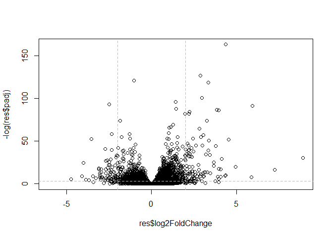
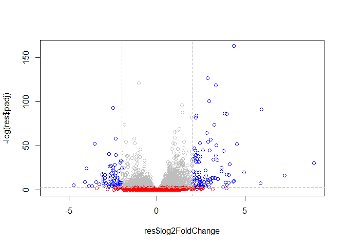
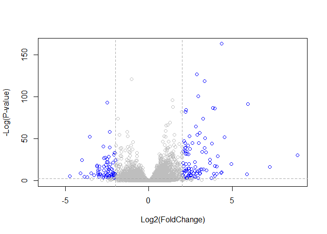

class14
================

## DESeq2 setup

We will use the DESeq2 package form bioconductor. To install this we ran
**in the CONSOLE** - note eval = FALSE option\!:

``` r
install.packages("BiocManager")
BiocManager::install()

# For this class, you'll also need DESeq2:
BiocManager::install("DESeq2")
```

``` r
library(BiocManager)
```

    ## Bioconductor version 3.10 (BiocManager 1.30.9), ?BiocManager::install for
    ##   help

``` r
library("DESeq2")
```

    ## Loading required package: S4Vectors

    ## Loading required package: stats4

    ## Loading required package: BiocGenerics

    ## Loading required package: parallel

    ## 
    ## Attaching package: 'BiocGenerics'

    ## The following objects are masked from 'package:parallel':
    ## 
    ##     clusterApply, clusterApplyLB, clusterCall, clusterEvalQ,
    ##     clusterExport, clusterMap, parApply, parCapply, parLapply,
    ##     parLapplyLB, parRapply, parSapply, parSapplyLB

    ## The following objects are masked from 'package:stats':
    ## 
    ##     IQR, mad, sd, var, xtabs

    ## The following objects are masked from 'package:base':
    ## 
    ##     anyDuplicated, append, as.data.frame, basename, cbind,
    ##     colnames, dirname, do.call, duplicated, eval, evalq, Filter,
    ##     Find, get, grep, grepl, intersect, is.unsorted, lapply, Map,
    ##     mapply, match, mget, order, paste, pmax, pmax.int, pmin,
    ##     pmin.int, Position, rank, rbind, Reduce, rownames, sapply,
    ##     setdiff, sort, table, tapply, union, unique, unsplit, which,
    ##     which.max, which.min

    ## 
    ## Attaching package: 'S4Vectors'

    ## The following object is masked from 'package:base':
    ## 
    ##     expand.grid

    ## Loading required package: IRanges

    ## 
    ## Attaching package: 'IRanges'

    ## The following object is masked from 'package:grDevices':
    ## 
    ##     windows

    ## Loading required package: GenomicRanges

    ## Loading required package: GenomeInfoDb

    ## Loading required package: SummarizedExperiment

    ## Loading required package: Biobase

    ## Welcome to Bioconductor
    ## 
    ##     Vignettes contain introductory material; view with
    ##     'browseVignettes()'. To cite Bioconductor, see
    ##     'citation("Biobase")', and for packages 'citation("pkgname")'.

    ## Loading required package: DelayedArray

    ## Loading required package: matrixStats

    ## 
    ## Attaching package: 'matrixStats'

    ## The following objects are masked from 'package:Biobase':
    ## 
    ##     anyMissing, rowMedians

    ## Loading required package: BiocParallel

    ## 
    ## Attaching package: 'DelayedArray'

    ## The following objects are masked from 'package:matrixStats':
    ## 
    ##     colMaxs, colMins, colRanges, rowMaxs, rowMins, rowRanges

    ## The following objects are masked from 'package:base':
    ## 
    ##     aperm, apply, rowsum

## import countData and colData

``` r
counts <- read.csv("data/airway_scaledcounts.csv", stringsAsFactors = FALSE)
metadata <-  read.csv("data/airway_metadata.csv", stringsAsFactors = FALSE)

head(counts)
```

    ##           ensgene SRR1039508 SRR1039509 SRR1039512 SRR1039513 SRR1039516
    ## 1 ENSG00000000003        723        486        904        445       1170
    ## 2 ENSG00000000005          0          0          0          0          0
    ## 3 ENSG00000000419        467        523        616        371        582
    ## 4 ENSG00000000457        347        258        364        237        318
    ## 5 ENSG00000000460         96         81         73         66        118
    ## 6 ENSG00000000938          0          0          1          0          2
    ##   SRR1039517 SRR1039520 SRR1039521
    ## 1       1097        806        604
    ## 2          0          0          0
    ## 3        781        417        509
    ## 4        447        330        324
    ## 5         94        102         74
    ## 6          0          0          0

``` r
head(metadata)
```

    ##           id     dex celltype     geo_id
    ## 1 SRR1039508 control   N61311 GSM1275862
    ## 2 SRR1039509 treated   N61311 GSM1275863
    ## 3 SRR1039512 control  N052611 GSM1275866
    ## 4 SRR1039513 treated  N052611 GSM1275867
    ## 5 SRR1039516 control  N080611 GSM1275870
    ## 6 SRR1039517 treated  N080611 GSM1275871

How many genes do we have in this dataset?

``` r
nrow(counts)
```

    ## [1] 38694

How many exps do we have?

``` r
nrow(metadata)
```

    ## [1] 8

## Toy differential gene expression

If we look at our metadata, we see that the control samples are
SRR1039508, SRR1039512, SRR1039516, and SRR1039520. This bit of code
will first find the sample id for those labeled control. Then calculate
the mean counts per gene across these samples:

``` r
control <- metadata[metadata[,"dex"] == "control", ]
control.mean <- rowSums(counts[, control$id]) / length(control$id)
names(control.mean) <- counts$ensgene
```

Q1. How would you make the above code more robust? What would happen if
you were to add more samples. Would the values obtained with the excat
code above be correct?

Q2. Follow the same procedure for the treated samples (i.e. calculate
the mean per gene accross drug treated samples and assign to a labeled
vector called treated.mean)

``` r
treated <- metadata[metadata[,"dex"] == "treated", ]
treated.mean <- rowSums(counts[, treated$id]) / nrow(treated)
names(treated.mean) <- counts$ensgene
```

We will combine our meancount data for bookkeeping purposes.

``` r
meancounts <- data.frame(control.mean, treated.mean)

colSums(meancounts)
```

    ## control.mean treated.mean 
    ##     23005324     22196524

Q3. Create a scatter plot showing the mean of the treated samples
against the mean of the control samples.

``` r
plot(control.mean, treated.mean, log = "xy", xlab = "log Control", ylab = "log Treated")
```

    ## Warning in xy.coords(x, y, xlabel, ylabel, log): 15032 x values <= 0
    ## omitted from logarithmic plot

    ## Warning in xy.coords(x, y, xlabel, ylabel, log): 15281 y values <= 0
    ## omitted from logarithmic plot

<!-- -->

We can find candidate differentially expressed genes by looking for
genes with a large change between control and dex-treated samples. We
usually look at the log2 of the fold change, because this has better
mathematical properties.

``` r
meancounts$log2fc <- log2(meancounts[,"treated.mean"]/meancounts[,"control.mean"])
head(meancounts)
```

    ##                 control.mean treated.mean      log2fc
    ## ENSG00000000003       900.75       658.00 -0.45303916
    ## ENSG00000000005         0.00         0.00         NaN
    ## ENSG00000000419       520.50       546.00  0.06900279
    ## ENSG00000000457       339.75       316.50 -0.10226805
    ## ENSG00000000460        97.25        78.75 -0.30441833
    ## ENSG00000000938         0.75         0.00        -Inf

The NaN is returned when you divide by zero and try to take the log. The
-Inf is returned when you try to take the log of zero. It turns out that
there are a lot of genes with zero expression. Let’s filter our data to
remove these genes.

``` r
zero.vals <- which(meancounts[,1:2]==0, arr.ind=TRUE)

# If arr.ind == TRUE and x is an array (has a dim attribute), the result is arrayInd(which(x), dim(x), dimnames(x)), namely a matrix whose rows each are the indices of one element of x

to.rm <- unique(zero.vals[,1])
mycounts <- meancounts[-to.rm,]
head(mycounts)
```

    ##                 control.mean treated.mean      log2fc
    ## ENSG00000000003       900.75       658.00 -0.45303916
    ## ENSG00000000419       520.50       546.00  0.06900279
    ## ENSG00000000457       339.75       316.50 -0.10226805
    ## ENSG00000000460        97.25        78.75 -0.30441833
    ## ENSG00000000971      5219.00      6687.50  0.35769358
    ## ENSG00000001036      2327.00      1785.75 -0.38194109

A common threshold used for calling something differentially expressed
is a log2(FoldChange) of greater than 2 or less than -2. Let’s filter
the dataset both ways to see how many genes are up or down-regulated.

``` r
up.ind <- mycounts$log2fc > 2
down.ind <- mycounts$log2fc < (-2)
```

Q5. Using the up.ind and down.ind vectors above can you determine how
many up and down regulated genes we have at the greater than 2 fc level?

``` r
sum(up.ind)
```

    ## [1] 250

``` r
sum(down.ind)
```

    ## [1] 367

## DESeq2 analysis

Let’s do this the right way. DESeq2 is an R package for analyzing
count-based NGS data like RNA-seq. It is available from Bioconductor.
Bioconductor is a project to provide tools for analyzing high-throughput
genomic data including RNA-seq, ChIP-seq and arrays.

``` r
library(DESeq2)
citation("DESeq2")
```

    ## 
    ##   Love, M.I., Huber, W., Anders, S. Moderated estimation of fold
    ##   change and dispersion for RNA-seq data with DESeq2 Genome
    ##   Biology 15(12):550 (2014)
    ## 
    ## A BibTeX entry for LaTeX users is
    ## 
    ##   @Article{,
    ##     title = {Moderated estimation of fold change and dispersion for RNA-seq data with DESeq2},
    ##     author = {Michael I. Love and Wolfgang Huber and Simon Anders},
    ##     year = {2014},
    ##     journal = {Genome Biology},
    ##     doi = {10.1186/s13059-014-0550-8},
    ##     volume = {15},
    ##     issue = {12},
    ##     pages = {550},
    ##   }

Importing data

``` r
dds <- DESeqDataSetFromMatrix(countData=counts, 
                              colData=metadata, 
                              design=~dex, 
                              tidy=TRUE)
```

    ## converting counts to integer mode

    ## Warning in DESeqDataSet(se, design = design, ignoreRank): some variables in
    ## design formula are characters, converting to factors

``` r
dds
```

    ## class: DESeqDataSet 
    ## dim: 38694 8 
    ## metadata(1): version
    ## assays(1): counts
    ## rownames(38694): ENSG00000000003 ENSG00000000005 ...
    ##   ENSG00000283120 ENSG00000283123
    ## rowData names(0):
    ## colnames(8): SRR1039508 SRR1039509 ... SRR1039520 SRR1039521
    ## colData names(4): id dex celltype geo_id

Run DESeq2

``` r
dds <- DESeq(dds)
```

    ## estimating size factors

    ## estimating dispersions

    ## gene-wise dispersion estimates

    ## mean-dispersion relationship

    ## final dispersion estimates

    ## fitting model and testing

Get the results

``` r
res <- results(dds)
View(res)
```

## Data visualization

\#\#\#Volcano plots

First, let’s add a column called sig to our full res results that
evaluates to TRUE only if padj\<0.05 and the absolute log2FoldChange\>2,
FALSE if not, and NA if padj is also NA.

``` r
res$sig <- res$padj<0.05 & abs(res$log2FoldChange)>2

# How many of each?
table(res$sig)
```

    ## 
    ## FALSE  TRUE 
    ## 24282   167

``` r
sum(is.na(res$sig))
```

    ## [1] 14245

``` r
# Dual all black plot
plot(res$log2FoldChange, -log(res$padj))
abline(v = c(-2, 2), col = "gray", lty = 2)
abline(h = -log(0.05), col = "gray", lty = 2)
```

<!-- -->

``` r
# Add some color please
mycols <- rep("grey", nrow(res))
# make points with +2 -2 fold change blue
mycols[ abs(res$log2FoldChange) > 2 ] <- "blue"

# make points below p-value cutoff red
mycols[ (res$padj) > 0.05 ] <- "red"

plot(res$log2FoldChange, -log(res$padj), col = mycols)
abline(v = c(-2, 2), col = "gray", lty = 2)
abline(h = -log(0.05), col = "gray", lty = 2)
```

<!-- -->

Here we first make a volcano plot with base graphics and color by our
res$sig+1 (we add 1 so we dont have 0 as a color and end up with white
points):

``` r
# Set the color palette for our plot
palette( c("gray","blue") )

plot( res$log2FoldChange,  -log(res$padj), 
 col=res$sig+1, ylab="-Log(P-value)", xlab="Log2(FoldChange)")

# Add some cut-off lines
abline(v=c(-2,2), col="darkgray", lty=2)
abline(h=-log(0.1), col="darkgray", lty=2)
```

<!-- -->

``` r
# Reset the color palette
palette("default")      
```

``` r
# Setup our custom point color vector 
mycols <- rep("gray", nrow(res))
mycols[ abs(res$log2FoldChange) > 2 ]  <- "red" 

inds <- (res$padj < 0.01) & (abs(res$log2FoldChange) > 2 )
mycols[ inds ] <- "blue"

#Volcano plot with custom colors 
plot( res$log2FoldChange,  -log(res$padj), 
 col=mycols, ylab="-Log(P-value)", xlab="Log2(FoldChange)" )

abline(v=c(-2,2), col="gray", lty=2)
abline(h=-log(0.1), col="gray", lty=2)
```

<!-- -->

Save our results for next day…

``` r
write.csv(res, file = "expression_results.csv")
```
