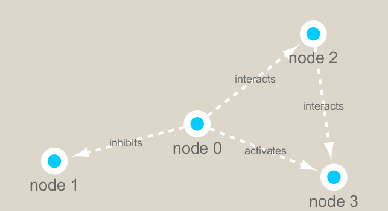

```{r setup, include=FALSE}
knitr::opts_chunk$set(echo = TRUE)
```

# Set up Cytoscape and R connection

```{r eval = FALSE}
BiocManager::install("RCy3")
BiocManager::install("igraph")
BiocManager::install("RColorBrewer")
```

## First contact

```{r}
# load the packages
library(RCy3)
library(igraph)

# Test the connection to Cytoscape
cytoscapePing()
```

```{r}
# Check the version
cytoscapeVersionInfo()
```

test things further by making a small network (here in igraph format as used by the R igraph package) and sending it to Cytoscape:

```{r}
g <- makeSimpleIgraph()
createNetworkFromIgraph(g,"myGraph")
```

```{r}
plot(g)
```

Tell cytoscape to export an image

```{r}
fig <- exportImage(filename = "demo", type = "png", height = 350)

# insert this image into Rmd report
knitr::include_graphics("./demo.png")
```

## Switch Styles

Change the cytoscape display style

```{r}
setVisualStyle("Marquee")
```

save and include image here in this report
```{r}
fig <- exportImage(filename = "demo_marquee", type = "png", height = 350)

```

you can find out what other styles are availbale and try a couple

```{r}
styles <- getVisualStyleNames()
styles
```

# Read our metagenomics data

We will read in a species co-occurrence matrix that was calculated using Spearman Rank coefficient.

```{r}
## scripts for processing located in "inst/data-raw/"
prok_vir_cor <- read.delim("./data/virus_prok_cor_abundant.tsv", stringsAsFactors = FALSE)

## Have a peak at the first 6 rows
head(prok_vir_cor)
```

Here we will use the igraph package to convert the co-occurrence dataframe into a network that we can send to Cytoscape. 

In this case our graph is undirected (so we will set directed = FALSE) since we do not have any information about the direction of the interactions from this type of data.

```{r}
g <- graph.data.frame(prok_vir_cor, directed = FALSE)

# check the class of new object g
class(g)

# print.igraph() function will be called to show an informative overview of the graph structure
g
```

Our current graph is a little too dense in terms of node labels etc. to have a useful ‘default’ plot figure. But we can have a look anyway.

```{r}
plot(g)
```

lets turn off the blue text labels

```{r}
plot(g, vertex.label = NA)
```

the nodes/vertex are too big. Lets make them smaller

```{r}
plot(g, vertex.size = 3, vertex.label = NA)
```


## Network querys

Note that we can query (and set) vertex and edge attributes with the **V()** and **E()** functions respectively:

```{r}
V(g)
E(g)
```

There are also the functions **vertex.attributes()** and **edge.attributes()** that query all vertex and edge attributes of an igraph object

```{r eval = FALSE}
vertex.attributes(g)
edge.attributes(g)
```

## Network community detection

Here we use the classic Girvan & Newman betweenness clustering method. The igraph package has lots of different community detection algorithms (i.e. different methods for finding communities).

```{r}
cb <- cluster_edge_betweenness(g)
```

```{r}
cb
```

```{r}
plot(cb, y = g, vertex.label = NA, vertex.size = 3)
```

You can extract a cluster/community membership vector for further inspection with the membership() function:

```{r}
head(membership(cb))
```

## Node Degree

The degree of a node or vertex is its most basic structural property, the number of its adjacent edges. Here we calculate and plot the node degree distribution.

```{r}
# calculate and plot node degree of our network
d <- degree(g)
hist(d, breaks = 30, col = "lightblue", main = "Node Degree Distribution")
```

For the **degree_distribution()** function a numeric vector of the same length as the maximum degree plus one is returned. The first element is the relative frequency zero degree vertices, the second vertices with degree one, etc.

```{r}
plot( degree_distribution(g), type="h" )
```

## Centrality analysis

Centrality gives an estimation on how important a node or edge is for the connectivity (or the information flow) of a network.

One centrality method that you can often find in publications is the Google PageRank score.

```{r}
pr <- page_rank(g)
head(pr$vector)
```

Lets plot our network with nodes size scaled via this page rank centrality scores.

```{r eval=FALSE}
BiocManager::install("BBmisc")
```


```{r}
library(RColorBrewer)
library(BBmisc)

# Make a size vector btwn 2 and 20 for node plotting size
v.size <- BBmisc::normalize(pr$vector, range=c(2,20), method="range")
plot(g, vertex.size=v.size, vertex.label=NA)
```

One of the simplest centrality scores is degree that we calculated previously and stored as the object d. Lets plot this one out also

```{r}
v.size <- BBmisc::normalize(d, range=c(2,20), method="range")
plot(g, vertex.size=v.size, vertex.label=NA)
```


Another very common centrality score is betweenness. The vertex and edge betweenness are (roughly) defined by the number of geodesics (shortest paths) going through a vertex or an edge.

```{r}
b <- betweenness(g)
v.size <- BBmisc::normalize(b, range=c(2,20), method="range")
plot(g, vertex.size=v.size, vertex.label=NA)
```

# Read taxonomic classification for network annotation

Since these are data from small, microscopic organisms that were sequenced using shotgun sequencing, we rely on the classification of the sequences to know what kind of organisms are in the samples.

```{r}
phage_id_affiliation <- read.delim("./data/phage_ids_with_affiliation.tsv")
head(phage_id_affiliation)

bac_id_affi <- read.delim("data/prok_tax_from_silva.tsv")
head(bac_id_affi)
```

## Add taxonomic anotation data to network

In preparation for sending the networks to Cytoscape we will add in the taxonomic data.

Some of the organisms do not have taxonomic classifications associated with them and these will get NA values below.

```{r}
## Extract out our vertex names
genenet.nodes <- as.data.frame(vertex.attributes(g), stringsAsFactors=FALSE)
head(genenet.nodes)
```

```{r}
length( grep("^ph_", genenet.nodes[ , 1]))
```

herefore we have 81 non phage nodes.

Now lets merge() these with the annotation data

```{r}
# We dont need all annotation data so lets make a reduced table 'z' for merging
z <- bac_id_affi[,c("Accession_ID", "Kingdom", "Phylum", "Class")]

n <- merge(genenet.nodes, z, by.x="name", by.y="Accession_ID", all.x=TRUE)

head(n)
```

```{r}
# Check on the column names before deciding what to merge
colnames(n)
```

```{r}
colnames(phage_id_affiliation)

# Again we only need a subset of `phage_id_affiliation` for our purposes
y <- phage_id_affiliation[, c("first_sheet.Phage_id_network", "phage_affiliation","Tax_order", "Tax_subfamily")]

# Add the little phage annotation that we have
x <- merge(x=n, y=y, by.x="name", by.y="first_sheet.Phage_id_network", all.x=TRUE)

## Remove duplicates from multiple matches
x <- x[!duplicated( (x$name) ),]
head(x)
```

Save our merged annotation results back to genenet.nodes.

```{r}
genenet.nodes <- x
```

# Send network to Cytoscape using RCy3

To begin we will delete any windows and networks that were already open in Cytoscape. This will clean the slate and help ensure we don’t use up all of our memory.

```{r}
# Open a new connection and delete any existing windows/networks in Cy
deleteAllNetworks()
```

We will need to set the first column in our **node** data.frame to id as this is what the RCy3 function **createNetworkFromDataFrames()** expects. Note that additional columns are loaded into Cytoscape as node attributes

Likewise the **edge** data.frame should contain columns of character strings named: source, target and interaction (with additional columns loaded as edge attributes).

```{r}
# Set the main nodes colname to the required "id" 
colnames(genenet.nodes)[1] <- "id"
```

```{r}
genenet.edges <- data.frame(igraph::as_edgelist(g))

# Set the main edges colname to the required "source" and "target" 
colnames(genenet.edges) <- c("source","target")

# Add the weight from igraph to a new column...
genenet.edges$Weight <- igraph::edge_attr(g)$weight

# Send as a new network to Cytoscape
createNetworkFromDataFrames(genenet.nodes,genenet.edges, 
                            title="Tara_Oceans")
```

# SessionInfo

```{r}
sessionInfo()
```

